# Incident Tracker

A fullstack app for managing production incidents — create, browse, filter, and update incidents with server-side pagination, dark mode, keyboard shortcuts, and CSV export.

**Stack:** React + TypeScript + Vite (frontend), Express + Prisma + SQLite (backend)

## Screenshots

### Dashboard — Light & Dark Mode

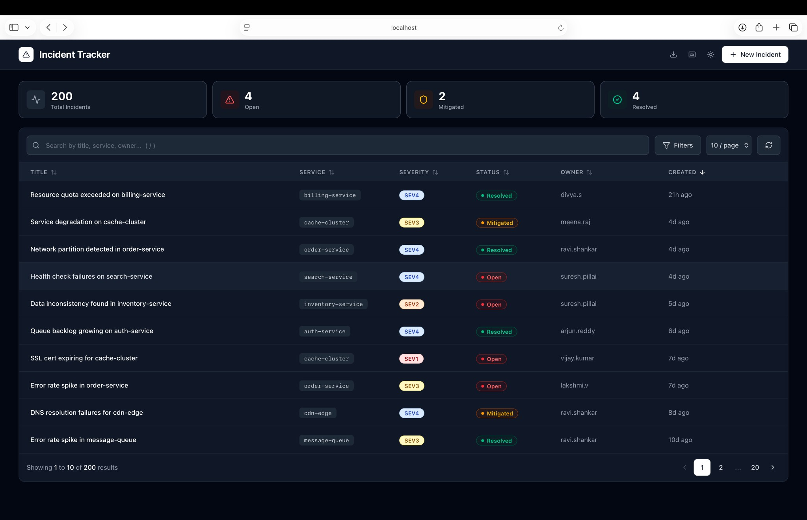

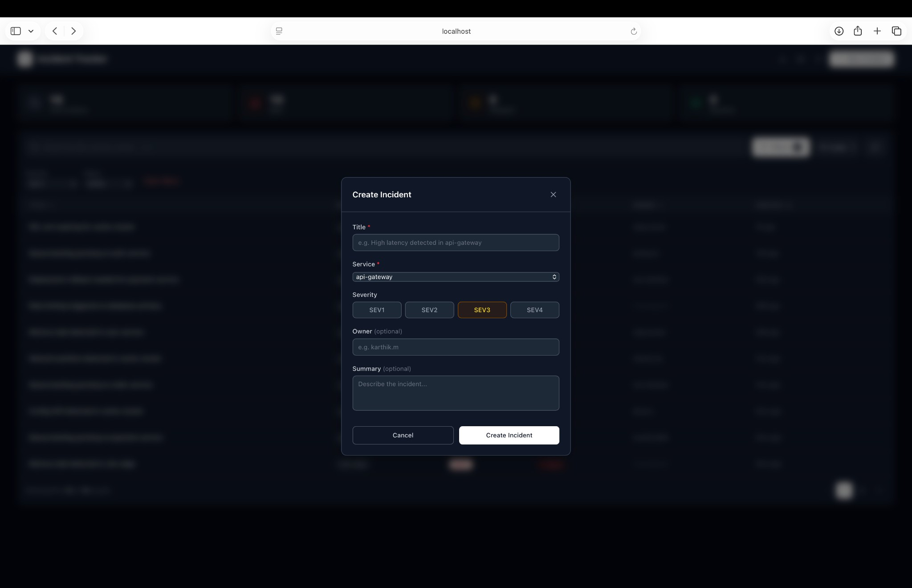

### Filtering & Search

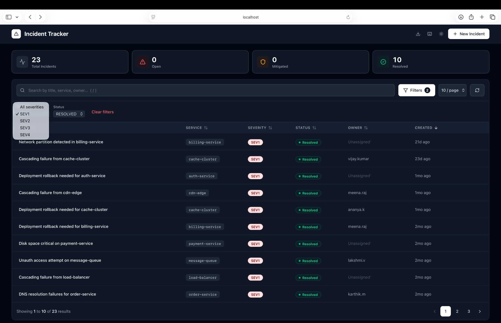

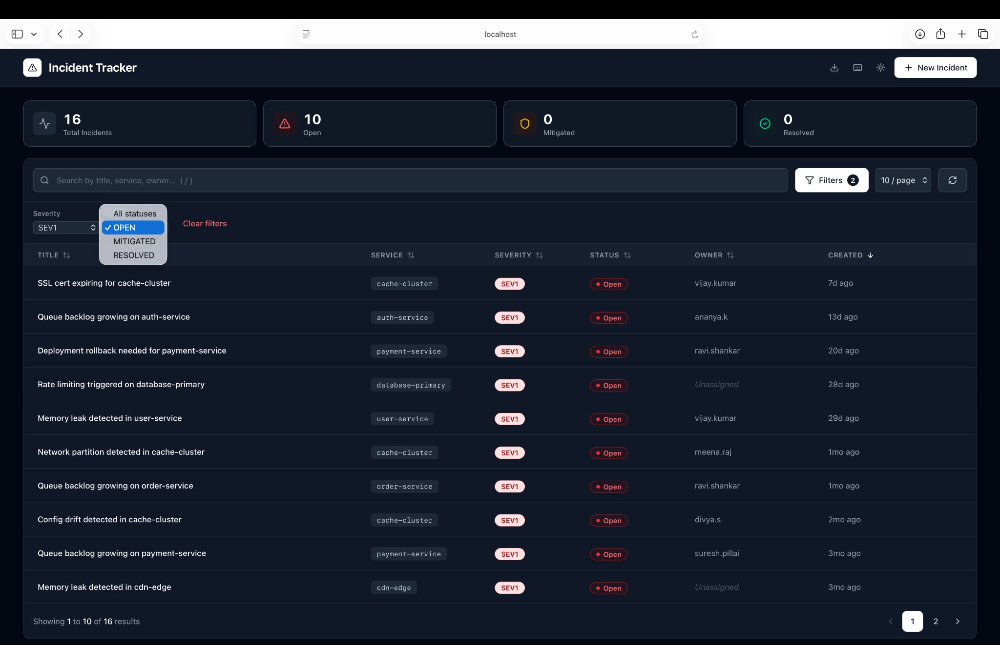

### Incident Detail & Editing

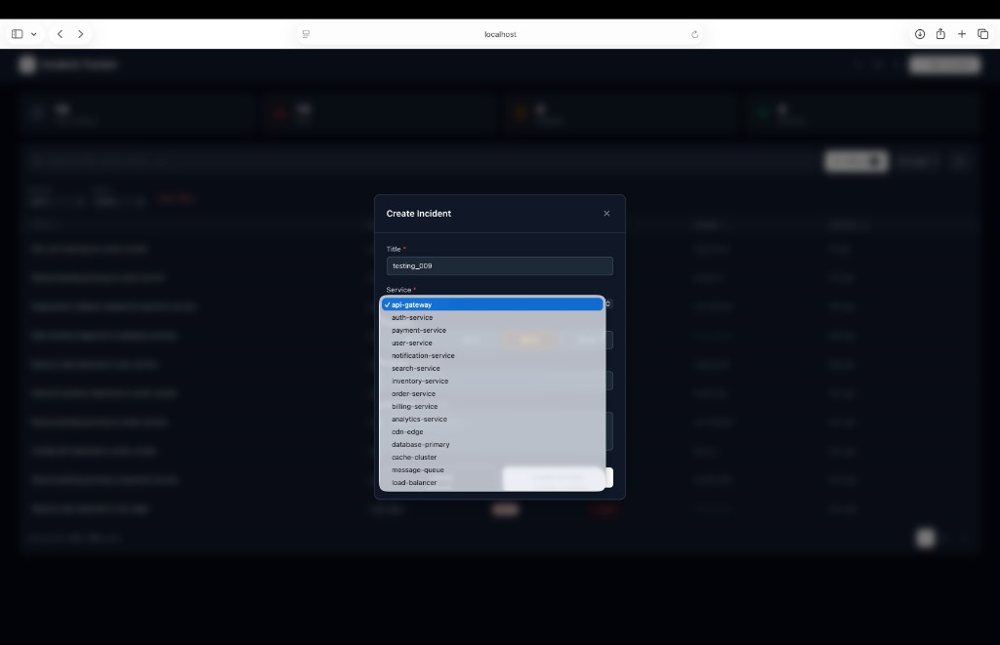

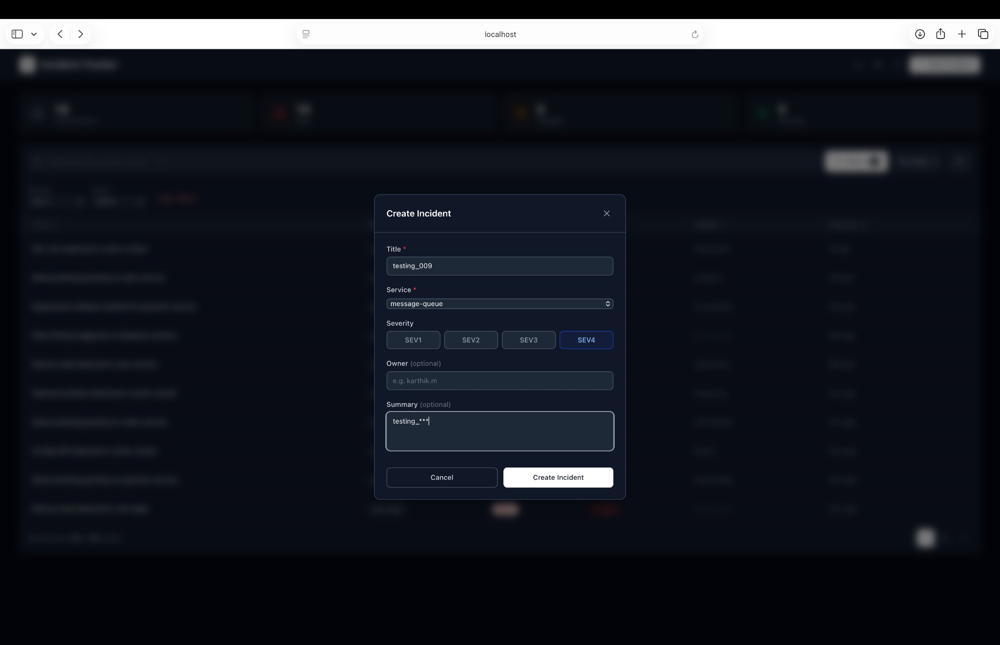

### Create Incident

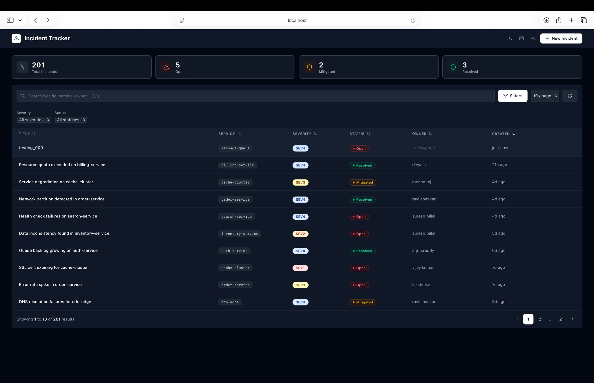

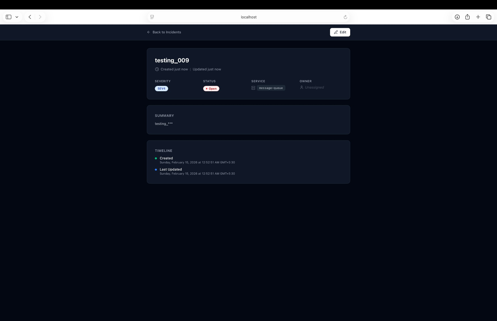

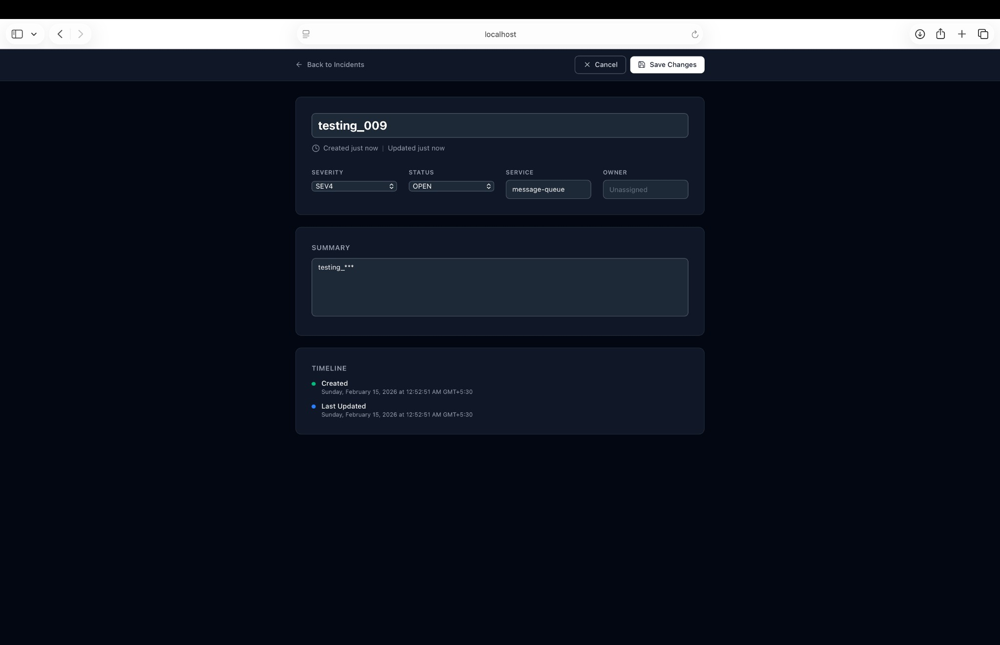

### Extra Features

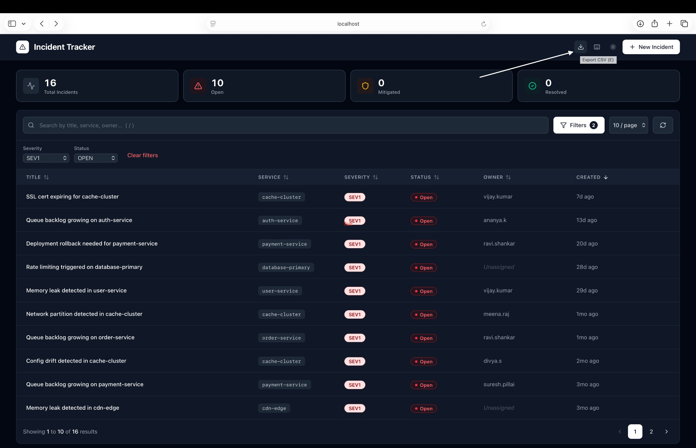

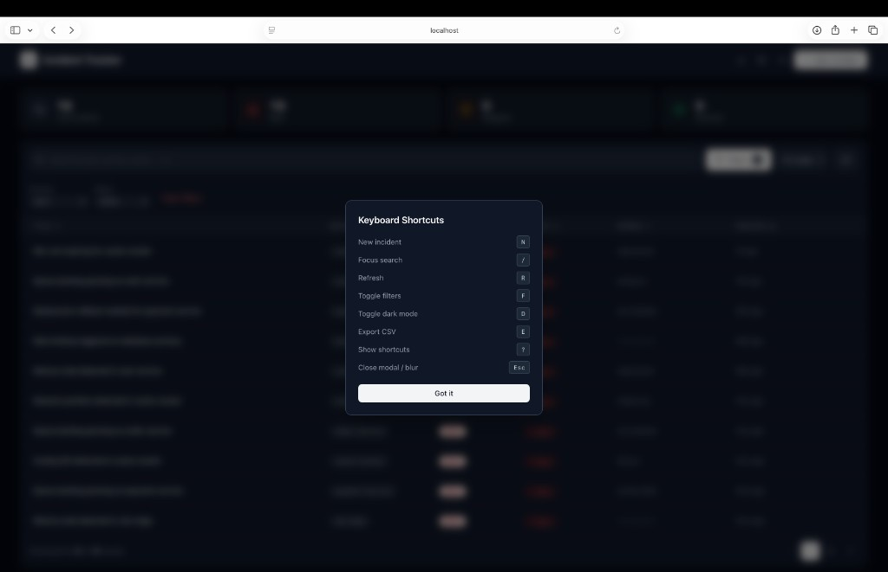

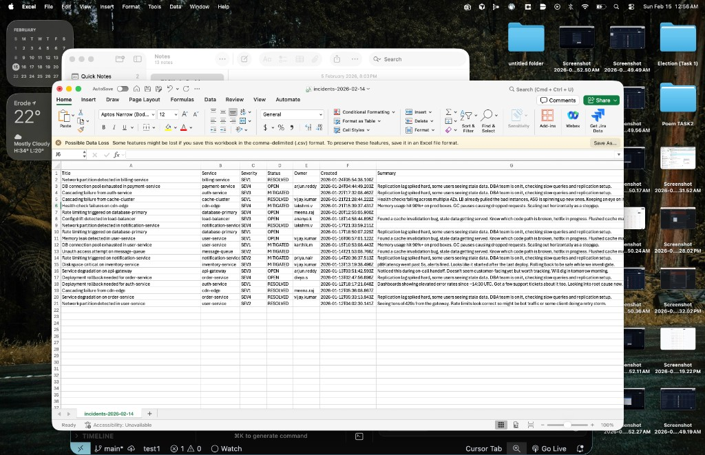

---

## Setup

You'll need Node >= 18.

### Backend

```bash
cd backend
npm install
npx prisma generate
npx prisma migrate dev
npm run seed     # populates ~200 incidents
npm run dev      # runs on :4000
```

### Frontend

```bash
cd frontend
npm install
npm run dev      # runs on :5173
```

Frontend proxies `/api` to the backend, so just open http://localhost:5173 and everything should work.

## Features

- **Server-side pagination** with configurable page size (10/20/50)
- **Debounced search** across title, service, owner, summary
- **Filters** by severity (SEV1-4) and status (Open/Mitigated/Resolved)
- **Column sorting** — click any header to sort asc/desc
- **Dark mode** — toggle with the moon icon or press `D`, respects system preference
- **Inline status change** — click any status badge in the table to change it without opening the detail page
- **CSV export** — download current view as a .csv file
- **Keyboard shortcuts** — press `?` to see all 8 shortcuts
- **Toast notifications** — feedback on create, update, export, and errors
- **Live relative timestamps** — "5m ago", "2d ago" that auto-refresh
- **Animated table rows** — subtle staggered fade-in on data load
- **Detail page** — full incident view with inline editing for all fields
- **Create incident modal** — form with validation and severity picker
- **Stats cards** — live counts of total, open, mitigated, and resolved incidents
- **Sticky header** — stays visible while scrolling
- **Responsive** — works on mobile and desktop

### Keyboard Shortcuts

| Key | Action |
|-----|--------|
| `N` | New incident |
| `/` | Focus search |
| `R` | Refresh |
| `F` | Toggle filters |
| `D` | Toggle dark mode |
| `E` | Export CSV |
| `?` | Show shortcuts |
| `Esc` | Close modal / blur |

## API

| Method | Endpoint             | What it does                                    |
| ------ | -------------------- | ----------------------------------------------- |
| GET    | `/api/incidents`     | List incidents — supports pagination, filtering, sorting, search |
| GET    | `/api/incidents/:id` | Get one incident                                |
| POST   | `/api/incidents`     | Create a new incident                           |
| PATCH  | `/api/incidents/:id` | Update an incident (partial updates)            |
| GET    | `/api/health`        | Health check                                    |

### Query params for GET `/api/incidents`

- `page` (default 1), `limit` (default 20, max 100)
- `search` — searches across title, service, owner, summary
- `severity` — comma-separated, e.g. `SEV1,SEV2`
- `status` — comma-separated, e.g. `OPEN,MITIGATED`
- `service` — partial match on service name
- `sortBy` — one of: title, severity, status, service, createdAt, updatedAt, owner
- `sortOrder` — `asc` or `desc` (default desc)

### Creating an incident

```json
POST /api/incidents
{
  "title": "High latency in api-gateway",
  "service": "api-gateway",
  "severity": "SEV2",
  "owner": "karthik.m",
  "summary": "p99 went past 5s after last deploy"
}
```

`severity` is required (SEV1-SEV4). `status` defaults to OPEN. `owner` and `summary` are optional.

### Updating

```json
PATCH /api/incidents/:id
{
  "status": "RESOLVED"
}
```

All fields optional — just send what you want to change.

## Data model

| Field       | Type     | Notes                          |
| ----------- | -------- | ------------------------------ |
| id          | UUID     | auto-generated                 |
| title       | string   | required, max 200 chars        |
| service     | string   | required                       |
| severity    | string   | SEV1 / SEV2 / SEV3 / SEV4     |
| status      | string   | OPEN / MITIGATED / RESOLVED    |
| owner       | string?  | optional                       |
| summary     | string?  | optional, max 2000 chars       |
| createdAt   | datetime | set automatically              |
| updatedAt   | datetime | set automatically              |

Indexes on: severity, status, service, createdAt, title — the columns people filter/sort on most.

## Design decisions

### Why SQLite?

Honestly, just for ease of setup. No need to install Postgres or spin up Docker for a take-home. The DB is just a file that gets created when you run migrations. If this were going to prod I'd swap to Postgres — it's a one-line change in the Prisma schema.

### Validation

Using Zod on the backend for request validation. It catches bad input early and returns readable error messages. The frontend also does basic validation before submitting, but the backend is the source of truth.

### Server-side pagination

All filtering, sorting, and pagination runs on the DB side. The list endpoint fires a `findMany` and `count` in parallel (`Promise.all`) so we get the data and total count in one round trip.

### React Query

Handles caching and data fetching on the frontend. The nice thing is `placeholderData` — when you switch pages or change filters, the old data stays visible while the new data loads in the background. Way better than flashing a loading spinner every time.

### Debounced search

Search input has a 300ms debounce so we're not hammering the API on every keystroke. Simple custom hook, nothing fancy.

### Dark mode

Uses `localStorage` to persist preference, falls back to system `prefers-color-scheme`. Toggle applies the `dark` class to the HTML root — TailwindCSS v4 picks it up with `@custom-variant dark`. Smooth 200ms transition on background/border colors.

### Inline status change

Clicking the status badge in the table row opens a dropdown to change status without navigating to the detail page. Uses `e.stopPropagation()` so the row click (navigate to detail) doesn't fire. Invalidates the query cache on success so the table updates immediately.

## Project structure

```
backend/
  prisma/           schema, migrations, seed script
  src/
    index.ts        express app setup
    db.ts           prisma client
    routes/         incident CRUD endpoints
    middleware/     error handler
    utils/          zod validation schemas

frontend/
  src/
    pages/          IncidentList (table), IncidentDetail (detail+edit)
    components/     badges, pagination, skeleton, modal, toast, stats, etc.
    hooks/          useDebounce, useDarkMode, useKeyboardShortcuts
    lib/            api client functions
    types/          typescript interfaces
```

## What I'd do with more time

- **Tests** — API integration tests with Supertest, component tests with Testing Library. Didn't include them here to keep the scope manageable but in a real project this would be the first thing I add.
- **Better search** — SQLite's `LIKE` is okay for this scale but for real search I'd use Postgres full-text search or something like Typesense.
- **Auth** — no authentication right now, anyone can hit the endpoints.
- **WebSocket updates** — so the table updates in real-time when someone else creates/modifies an incident.
- **Docker Compose** — for one-command setup.
- **Audit trail** — log who changed what and when.
